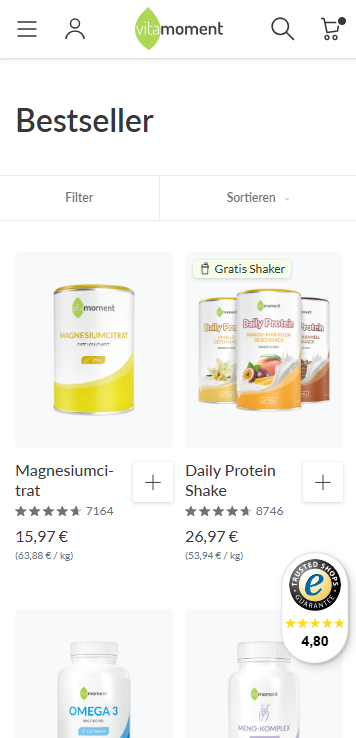

# Assessment Collection Filters

Wir freuen uns, dass du diese kurze Testaufgabe lösen möchtest. Das Ziel ist es, herauszufinden, ob unsere Vorstellungen der Arbeitsweise und der Fähigkeiten für die Web Developer Rolle übereinstimmen und eine Zusammenarbeit das Richtige für uns beide ist.

In diesem Repository findest du alle Infos, die du dafür brauchst. Die Aufgabe zielt auf einen Aufwand von maximal 2-3 Stunden ab. Das Ziel ist keinesfalls, in der kurzen Zeit eine vollumfängliche und einsatzbereite Lösung für das Problem zu entwickeln, sondern eine technische Basis zu entwerfen, welche potenziell auch von einem anderen Teammitglied weiterentwickelt werden kann. Produzierter Code und Text sollten dafür gut strukturiert und verständlich sein, wobei neben der Verwendung sinnvoller Namen für Funktionen/Variablen auch Code-Kommentare helfen können.

## Problembeschreibung

In unserem Shop unter [vitamoment.de](https://vitamoment.de) soll eine neue Filter-Funktion für Collection-Pages entworfen und umgesetzt werden.

Aktuell existiert bereits eine simple Filterung nach Produkteigenschaften in unserem Shop. Die Filter sollen allerdings einmal komplett neu gedacht werden. Du hast deshalb in der Umsetzung alle Freiheiten. Es ist zum Beispiel auch dir überlassen, ob du die Filterauswahl in einer Sidebar, einem Modal, einem Popover, einem Collapsible etc. darstellst.

Folgende Filtermöglichkeiten soll es geben:
- Preis (0-20€, >20€-30€, >30€-40€, >40€)
- Verfügbarkeit (Zeige nur verfügbare Produkte)
- Einnahmeform (Kapseln, Pulver, Tropfen, Spray, Sonstiges)

Zusätzliche Anforderungen:
- Die Optionen für Preis und Verfügbarkeit sollen auch angezeigt werden, wenn in der Collection keine entsprechenden Produkte vorhanden sind. Diese Optionen sollen dann nicht auswählbar sein.
- Bei der Einnahmeform sollen nur die Optionen angezeigt werden, für die es auch Produkte in der aktuellen Collection gibt.

## Ausgangslage

Beim Datenschema sollst du dich an dem orientieren, was Shopify vorgibt. Siehe dir auch auch unten die hilfreichen Links an. Dir stehen außerdem in `example-collection.json` Beispieldaten für unsere Bestseller-Collection zur Verfügung, auf welche du während der Implementation zurückgreifen kannst. Das dortige Datenschema entspricht dem Shopify-Datenschema für Liquid, wurde allerdings stark reduziert, indem einige nicht notwendige Daten weggelassen wurden.

Im `src` Ordner findest du eine stark vereinfachte Collection Page, welche du als Basis deiner Implementation nutzen kannst. Hier sind bereits die Produkte entsprechend den Daten in `example-collection.json` dargestellt. Ergänze den Code wie es erforderlich ist.

## Aufgabe

Es soll in mehreren Schritten eine Lösung für die neuen Collection-Filter entwickelt werden. Die einzelnen Arbeitsergebnisse müssen nicht im Detail ausgearbeitet werden. Wenn bestimmte Anforderungen aus Zeitgründen nicht implementiert werden können, reicht es durch Kommentare an den entsprechenden Stellen zu skizzieren, was hier noch passieren/implementiert werden müsste.

In Klammern findest du Empfehlungen für die Verteilung des Aufwands auf die einzelnen Schritte.

1. Klone dieses Repository um lokal daran arbeiten zu können.
2. Erstelle ein simples Wireframe für die Filterauswahl. Der Fokus soll hier klar auf einem groben Layout liegen, Details oder sonstige visuelle Feinheiten spielen keine Rolle. Du kannst dies beispielsweise mit einer Zeichnung umsetzen. (10-15min)
3. Schaue dir in der Shopify-Liquid Doku zum Produkt-Objekt an, welche Datenfelder du für die Filteroptionen benötigst und notiere sie. Sollten die notwendigen Daten nicht durch die Standard-Shopify-Produktdaten abgebildet sein, mache einen Vorschlag, wie man die Daten in Shopify konkret modellieren und speichern könnte. (20-30min)
4. Implementiere das Interface und die Funktionalität der Collection Filter mit HTML, CSS und JavaScript. Hierbei dürfen Daten explizit in das erstellte HTML hardgecodet werden. In der Realität würde man das HTML natürlich Server-seitig aus den Daten generieren, aus Komplexitätsgründen nutzen wir hier nur Client-seitigen Code. Das CSS soll sich so wie das Wireframe auf das grobe Layout beschränken. (90-135min)

## Hilfreiche Links
- [Shopify Produkt-Daten in Liquid](https://shopify.dev/docs/api/liquid/objects/product)
- [Shopify Collection-Daten in Liquid](https://shopify.dev/docs/api/liquid/objects/collection)
- [Beispiel Collection in unserem Shop](https://vitamoment.de/collections/bestseller)